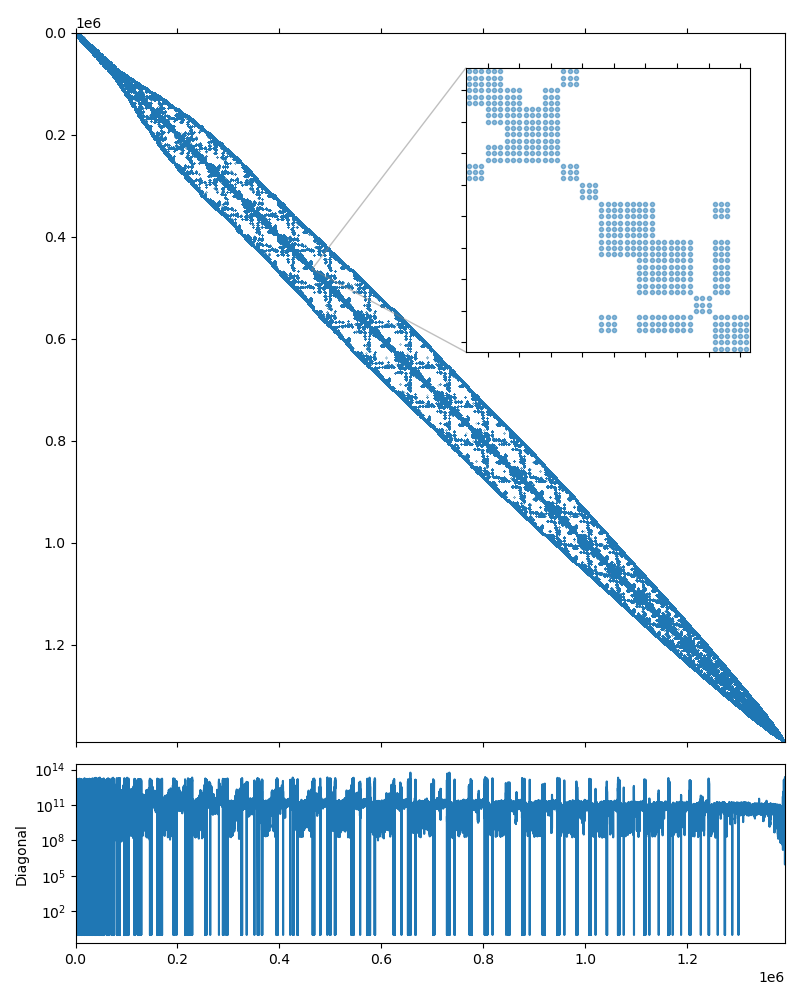

3D structural problem
---------------------

This system may be downloaded from the Serena_ page (use the `Matrix Market`_
download option). According to the description, the system represents a gas
resevoir simulation for CO2 sequestration, and was obtained from a structural
problem discretizing a gas reservoir with tetrahedral Finite Elements. The
medium is strongly heterogeneous and characterized by a complex geometry
consisting of alternating sequences of thin clay and sand layers. More details
available in [FGJT10]_.  Note that the RHS vector for the Serena problem is not
provided, and we use the RHS vector filled with ones.

The system matrix is symmetric, and has 1,391,349 rows and 64,131,971 nonzero
values, which corresponds to an average of 46 nonzeros per row. The matrix
portrait is shown on the figure below.

.. _Serena: https://sparse.tamu.edu/Janna/Serena
.. _Matrix Market: https://math.nist.gov/MatrixMarket
.. _examples/solver: https://github.com/ddemidov/amgcl/blob/master/examples/solver.cpp
.. _examples/mm2bin: https://github.com/ddemidov/amgcl/blob/master/examples/mm2bin.cpp

   Serena matrix portrait

.. [FGJT10] M. Ferronato, G. Gambolati, C. Janna, P. Teatini. "Geomechanical issues of anthropogenic CO2 sequestration in exploited gas fields", Energy Conversion and Management, 51, pp. 1918-1928, 2010.

As in the case of :doc:`poisson3Db` tutorial, we start experimenting with the
`examples/solver`_ utility provided by AMGCL. The default options do not seem
to work this time. The relative error did not reach the required threshold of
1e-8 and the solver exited after the default limit of 100 iterations::

    $ solver -A Serena.mtx
    Solver
    ======
    Type:             BiCGStab
    Unknowns:         1391349
    Memory footprint: 74.31 M

    Preconditioner
    ==============
    Number of levels:    4
    Operator complexity: 1.22
    Grid complexity:     1.08
    Memory footprint:    1.45 G

    level     unknowns       nonzeros      memory
    ---------------------------------------------
        0      1391349       64531701      1.22 G (82.01%)
        1        98824       13083884    218.40 M (16.63%)
        2         5721        1038749     16.82 M ( 1.32%)
        3          279          29151    490.75 K ( 0.04%)

    Iterations: 100
    Error:      0.000874761

    [Profile:      74.102 s] (100.00%)
    [  reading:    18.505 s] ( 24.97%)
    [  setup:       2.101 s] (  2.84%)
    [  solve:      53.489 s] ( 72.18%)

The system is quite large and just reading from the text-based `Matrix Market`_
format takes 18.5 seconds. No one has that amount of free time on their hands,
so lets convert the matrix into the binary format with the `examples/mm2bin`_
utility. This should make the experiments slightly less painful::

    mm2bin -i Serena.mtx -o Serena.bin
    Wrote 1391349 by 1391349 sparse matrix, 64531701 nonzeros

The ``-B`` option tells the solver that the input is in
binary format now. Lets also increase the maximum iteration limit this time to
see if the solver manages to converge at all::

    $ solver -B -A Serena.bin solver.maxiter=1000
    Solver
    ======
    Type:             BiCGStab
    Unknowns:         1391349
    Memory footprint: 74.31 M

    Preconditioner
    ==============
    Number of levels:    4
    Operator complexity: 1.22
    Grid complexity:     1.08
    Memory footprint:    1.45 G

    level     unknowns       nonzeros      memory
    ---------------------------------------------
        0      1391349       64531701      1.22 G (82.01%)
        1        98824       13083884    218.40 M (16.63%)
        2         5721        1038749     16.82 M ( 1.32%)
        3          279          29151    490.75 K ( 0.04%)

    Iterations: 211
    Error:      8.54558e-09

    [Profile:     114.703 s] (100.00%)
    [  reading:     0.550 s] (  0.48%)
    [  setup:       2.114 s] (  1.84%)
    [  solve:     112.034 s] ( 97.67%)

The input matrix is read much faster now, and the solver does converge, but the
convergence rate is not great. Looking closer at the :ref:`serena_spy` figure,
the matrix seems to have block structure with :math:`3\times3` blocks.  This is
usually the case when the system has been obtained via discretization of a
system of coupled PDEs, or has vector unknowns. We have to guess here, but
since the problem is described as "structural", then each block probably
corresponds to the 3D displacement vector of a single grid node. We can
communicate this piece of information to AMGCL using the ``block_size``
parameter of the aggregation method::

    $ solver -B -A Serena.bin solver.maxiter=1000 \
          precond.coarsening.aggr.block_size=3
    Solver
    ======
    Type:             BiCGStab
    Unknowns:         1391349
    Memory footprint: 74.31 M

    Preconditioner
    ==============
    Number of levels:    4
    Operator complexity: 1.31
    Grid complexity:     1.08
    Memory footprint:    1.84 G

    level     unknowns       nonzeros      memory
    ---------------------------------------------
        0      1391349       64531701      1.50 G (76.48%)
        1       109764       17969220    316.66 M (21.30%)
        2         6291        1788507     29.51 M ( 2.12%)
        3          429          82719      1.23 M ( 0.10%)

    Iterations: 120
    Error:      9.73074e-09

    [Profile:      73.296 s] (100.00%)
    [  reading:     0.587 s] (  0.80%)
    [  setup:       2.709 s] (  3.70%)
    [  solve:      69.994 s] ( 95.49%)

This has definitely improved the convergence! We also know that the matrix is
symmetric, so lets switch the solver from the default BiCGStab to the slightly
less expensive CG::

    $ solver -B -A Serena.bin \
          solver.type=cg \
          solver.maxiter=1000 \
          precond.coarsening.aggr.block_size=3
    Solver
    ======
    Type:             CG
    Unknowns:         1391349
    Memory footprint: 42.46 M

    Preconditioner
    ==============
    Number of levels:    4
    Operator complexity: 1.31
    Grid complexity:     1.08
    Memory footprint:    1.84 G

    level     unknowns       nonzeros      memory
    ---------------------------------------------
        0      1391349       64531701      1.50 G (76.48%)
        1       109764       17969220    316.66 M (21.30%)
        2         6291        1788507     29.51 M ( 2.12%)
        3          429          82719      1.23 M ( 0.10%)

    Iterations: 177
    Error:      8.6598e-09

    [Profile:      55.250 s] (100.00%)
    [  reading:     0.550 s] (  1.00%)
    [  setup:       2.801 s] (  5.07%)
    [  solve:      51.894 s] ( 93.92%)

This reduces the solution time, even though the number of iterations
has grown. Each iteration of BiCGStab costs about twice as much as a CG
iteration, because BiCGStab does two matrix-vector products and preconditioner
applications per iteration, while CG only does one.

The problem description states that *the medium is strongly heterogeneous and
characterized by a complex geometry consisting of alternating sequences of thin
clay and sand layers*. This may result in high contrast between matrix
coefficients in the neighboring rows, which is confirmed by the plot of the
matrix diagonal in :ref:`serena_spy`: the diagonal coefficients span more than
10 orders of magnitude! Scaling the matrix (so that it has the unit diagonal)
should help with the convergence. The ``-s`` option tells the solver to do
that::

    $ solver -B -A Serena.bin -s \
          solver.type=cg solver.maxiter=200 \
          precond.coarsening.aggr.block_size=3
    Solver
    ======
    Type:             CG
    Unknowns:         1391349
    Memory footprint: 42.46 M

    Preconditioner
    ==============
    Number of levels:    4
    Operator complexity: 1.29
    Grid complexity:     1.08
    Memory footprint:    1.82 G

    level     unknowns       nonzeros      memory
    ---------------------------------------------
        0      1391349       64531701      1.51 G (77.81%)
        1       100635       16771185    294.81 M (20.22%)
        2         5643        1571157     25.92 M ( 1.89%)
        3          342          60264    802.69 K ( 0.07%)

    Iterations: 112
    Error:      9.84457e-09

    [Profile:      36.021 s] (100.00%)
    [ self:         0.204 s] (  0.57%)
    [  reading:     0.564 s] (  1.57%)
    [  setup:       2.684 s] (  7.45%)
    [  solve:      32.568 s] ( 90.42%)

And the convergence has indeed been improved! Finally, when the matrix has
block structure, as in this case, it often pays to use the block-valued
backend, so that the system matrix has three times fewer rows and columns, but
each nonzero entry is a statically sized :math:`3\times3` matrix. This should
be done instead of specifying the ``block_size`` aggregation parameter, as the
aggregation now naturally operates with the :math:`3\times3` blocks::

    $ solver -B -A Serena.bin solver.type=cg solver.maxiter=200 -s -b3
    Solver
    ======
    Type:             CG
    Unknowns:         463783
    Memory footprint: 42.46 M

    Preconditioner
    ==============
    Number of levels:    4
    Operator complexity: 1.27
    Grid complexity:     1.08
    Memory footprint:    1.04 G

    level     unknowns       nonzeros      memory
    ---------------------------------------------
        0       463783        7170189    891.53 M (78.80%)
        1        33052        1772434    159.22 M (19.48%)
        2         1722         151034     12.72 M ( 1.66%)
        3           98           5756    612.72 K ( 0.06%)

    Iterations: 162
    Error:      9.7497e-09

    [Profile:      31.122 s] (100.00%)
    [ self:         0.204 s] (  0.66%)
    [  reading:     0.550 s] (  1.77%)
    [  setup:       1.013 s] (  3.26%)
    [  solve:      29.354 s] ( 94.32%)

Note that the preconditioner now requires 1.04G of memory as opposed to 1.82G
in the scalar case.  The setup is about 2.5 times faster, and the solution
phase performance has been slightly improved, even though the number of
iteration has grown.  This is explained by the fact that the matrix is now
symbolically smaller, and is easier to analyze during setup. The matrix also
occupies less memory for the CRS arrays, and is more cache-friendly, which
helps to speed up the solution phase. This seems to be the best we can get with
this system, so let us implement this version. We will also use the mixed
precision approach in order to get as much performance as possible from the
solution. The listing below shows the complete solution and is also available
in `tutorial/2.Serena/serena.cpp`_.

.. literalinclude:: ../tutorial/2.Serena/serena.cpp
   :caption: The source code for the solution of the Serena problem.
   :language: cpp
   :linenos:

.. _tutorial/2.Serena/serena.cpp: https://github.com/ddemidov/amgcl/blob/master/tutorial/2.Serena/serena.cpp

In addition the the includes described in :doc:`poisson3Db`, we also include
the headers for the :cpp:class:`amgcl::static_matrix` value type, and the
:cpp:func:`amgcl::adapter::block_matrix` adapter that transparently converts
a scalar matrix to the block format. In lines 42--58 we apply the scaling
according to the following formula:

.. math:: A_s = D^{-1/2} A D^{-1/2}, \quad f_s = D^{-1/2} f

where :math:`A_s` and :math:`f_s` are the scaled matrix and the RHS vector, and
:math:`D` is the diagonal of the matrix :math:`A`.  After solving the scaled
system :math:`A_s y = f_s`, the solution to the original system may be found as
:math:`x = D^{-1/2} y`.

In lines 66--68 we define the block value types for the matrix and the RHS and
solution vectors. ``dmat_type`` and ``smat_type`` are :math:`3\times3` static
matrices used as value types with the double precision solver backend and the
single precision preconditioner backend. ``dvec_type`` is a double precision
:math:`3\times1` matrix (or a vector) used as a value type for the RHS and the
solution.

The solver class definition in lines 73--80 is almost the same as in the
:doc:`poisson3Db` case, with the exception that we are using the CG iterative
solver this time.  In lines 83--84 we define the solver parameters. Namely, we
increase the maximum iterations limit to 500 iterations.

In lines 90--91 we instantiate the solver, using the ``block_matrix`` adapter
in order to convert the scalar matrix into the block format. The adapter
operates on a row-by-row basis and does not create a temporary copy of the
matrix.

In lines 103--106 we convert the scalar RHS and solution vectors to the
block-valued ones. We use the fact that 3 consecutive elements of a scalar
array may be reinterpreted as a single :math:`3\times1` static matrix. Using
the ``reinterpret_cast`` trick we can get the block-valued view into the RHS
and the solution vectors data without extra memory copies.

Here is the output of the program::

    $ ./serena Serena.mtx 
    Matrix Serena.mtx: 1391349x1391349
    Solver
    ======
    Type:             CG
    Unknowns:         463783
    Memory footprint: 42.46 M

    Preconditioner
    ==============
    Number of levels:    4
    Operator complexity: 1.27
    Grid complexity:     1.08
    Memory footprint:    585.33 M

    level     unknowns       nonzeros      memory
    ---------------------------------------------
        0       463783        7170189    490.45 M (78.80%)
        1        33052        1772434     87.58 M (19.48%)
        2         1722         151034      7.00 M ( 1.66%)
        3           98           5756    306.75 K ( 0.06%)

    Iters: 162
    Error: 9.74929e-09

    [Serena:     48.427 s] (100.00%)
    [ self:       0.166 s] (  0.34%)
    [  read:     21.115 s] ( 43.60%)
    [  setup:     0.749 s] (  1.55%)
    [  solve:    26.397 s] ( 54.51%)

Note that due to the use of mixed precision the preconditioner consumes 585.33M
of memory as opposed to 1.08G from the example above. The setup and the
solution are faster that the full precision version by about 30% and 10%
correspondingly.

Let us see if using a GPU backend may further improve the performance. The CUDA
backend does not support block value types, so we will use the VexCL backend
(which, in turn, may use either OpenCL, CUDA, or OpenMP). The listing below
contains the complete source for the solution (available at
`tutorial/2.Serena/serena_vexcl.cpp`_). The differences with the builtin
backend version are highlighted.

.. literalinclude:: ../tutorial/2.Serena/serena_vexcl.cpp
   :caption: The solution of the Serena problem with VexCL backend.
   :language: cpp
   :linenos:
   :emphasize-lines: 4-5,28-29,32-33,81-82,98-99,106,119-120,127-128,131

.. _tutorial/2.Serena/serena_vexcl.cpp: https://github.com/ddemidov/amgcl/blob/master/tutorial/2.Serena/serena_vexcl.cpp

In the include section, we replace the header for the builtin backend with the
one for the VexCL backend, and also include the header with support for block
values in VexCL (lines 4--5). In lines 28--29 we initialize the VexCL context,
and in lines 32--33 we enable the VexCL support for :math:`3\times3` static
matrices in both double and single precision.

In lines 81--82 we define the solver and preconditioner backends as VexCL
backends with the corresponding matrix value types. In lines 98--99 we
reference the VexCL context in the backend parameters.

Since we are using the GPU backend, we have to explicitly form the block valued
matrix and transfer it to the GPU. This is done in lines 119--120. In lines
127--128 we copy the RHS and the solution vectors to the GPU, and we solve the
system in line 131.

The output of the program is shown below::

    $ ./serena_vexcl_cuda Serena.mtx 
    1. GeForce GTX 1050 Ti

    Matrix Serena.mtx: 1391349x1391349
    Solver
    ======
    Type:             CG
    Unknowns:         463783
    Memory footprint: 42.46 M

    Preconditioner
    ==============
    Number of levels:    4
    Operator complexity: 1.27
    Grid complexity:     1.08
    Memory footprint:    585.33 M

    level     unknowns       nonzeros      memory
    ---------------------------------------------
        0       463783        7170189    490.45 M (78.80%)
        1        33052        1772434     87.58 M (19.48%)
        2         1722         151034      7.00 M ( 1.66%)
        3           98           5756    309.04 K ( 0.06%)

    Iters: 162
    Error: 9.74928e-09

    [Serena:          27.208 s] (100.00%)
    [ self:            0.180 s] (  0.66%)
    [  GPU matrix:     0.604 s] (  2.22%)
    [  read:          18.699 s] ( 68.73%)
    [  setup:          1.308 s] (  4.81%)
    [  solve:          6.417 s] ( 23.59%)

The setup time has increased from 0.7 seconds for the builtin backend to 1.3
seconds, and we also see the additional 0.6 seconds for transferring the matrix to the
GPU. But the solution time has decreased from 26.4 to 6.4 seconds, which is
about 4 times faster.
