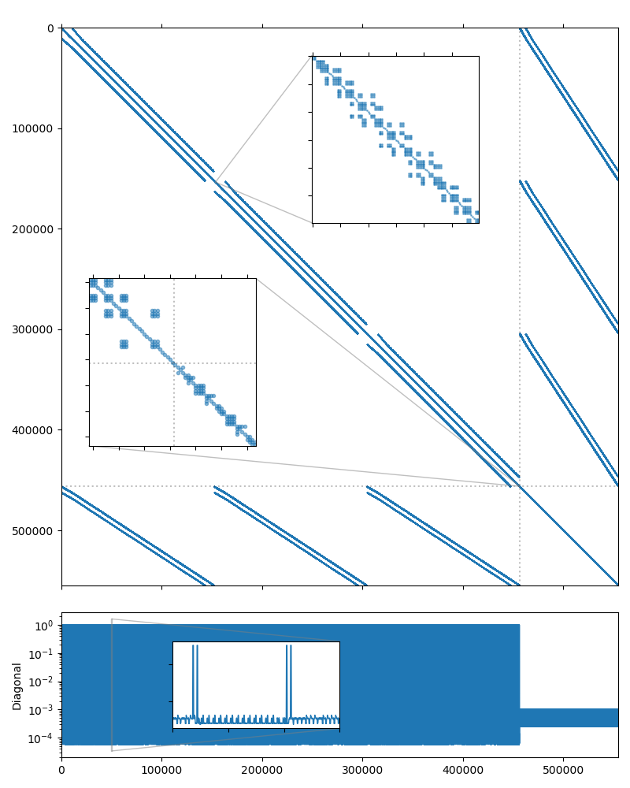

Stokes-like problem
-------------------

In this section we consider a saddle point system which was obtained by
discretization of the steady incompressible Stokes flow equations in a unit
cube with a locally divergence-free weak Galerkin finite element method. The
UCube(4) system studied here may be downloaded from the the `dataset
<https://doi.org/10.5281/zenodo.4134357>`_ accompanying the paper [DeMW20]_. We
will use the UCube(4) system from the dataset. The system matrix is symmetric
and has 554,496 rows and 14,292,884 nonzero values, which corresponds to an
average of 26 nonzero entries per row. The matrix sparsity portrait is shown on
the figure below.

.. _SuiteSparse Matrix Collection: https://sparse.tamu.edu/

   UCube(4) matrix portrait

As with any Stokes-like problem, the system has a general block-wise structure:

.. math::

    \begin{bmatrix} A & B_1^T \\ B_2 & C \end{bmatrix}
    \begin{bmatrix} \mathbf x_u \\ \mathbf x_p \end{bmatrix} =
    \begin{bmatrix} \mathbf b_u \\ \mathbf b_p \end{bmatrix}

In this case, the upper left subblock :math:`A` corresponds the the flow
unknowns, and itself has block-wise structure with small :math:`3\times3`
blocks. The lower right subblock :math:`C` corresponds to the pressure
unknowns. There is a lot of research dedicated to the efficient solution of
such systems, see [BeGL05]_ for an extensive overview.  The direct approach of
using a monolithic preconditioner usually does not work very well, but we may
try it to have a reference point. The AMG preconditioning does not yield a
converging solution, but a single level ILU(0) relaxation seems to work with a
CG iterative solver::

    $ solver -B -A ucube_4_A.bin -f ucube_4_b.bin \
          solver.type=cg solver.maxiter=500 \
          precond.class=relaxation precond.type=ilu0
    Solver
    ======
    Type:             CG
    Unknowns:         554496
    Memory footprint: 16.92 M

    Preconditioner
    ==============
    Relaxation as preconditioner
      Unknowns: 554496
      Nonzeros: 14292884
      Memory:   453.23 M

    Iterations: 270
    Error:      6.84763e-09

    [Profile:       9.300 s] (100.00%)
    [  reading:     0.133 s] (  1.43%)
    [  setup:       0.561 s] (  6.03%)
    [  solve:       8.599 s] ( 92.46%)

A preconditioner that takes the structure of the system into account should be
a better choice performance-wise. AMGCL provides an implementation of the Schur
complement pressure correction preconditioner. The preconditioning step
consists of solving two linear systems:

.. math::
   :label: schurpc_eq

    \begin{aligned}
        S \mathbf x_p &= \mathbf b_p - B_2 A^{-1} \mathbf b_u, \\
        A \mathbf x_u &= \mathbf b_u - B_1^T \mathbf b_p.
    \end{aligned}

Here :math:`S` is the Schur complement :math:`S = C - B_2 A^{-1} B_1^T`.  Note
that forming the Schur complement matrix explicitly is prohibitively expensive,
and the following approximation is used to create the preconditioner for the
first equation in :eq:`schurpc_eq`:

.. math::

    \hat S = C - \mathop{\mathrm{diag}}\left( B_2 \mathop{\mathrm{diag}}(A)^{-1} B_1^T \right).

There is no need to solve the equations :eq:`schurpc_eq` exactly. It is enough
to perform a single application of the corresponding preconditioner as an
approximation to :math:`S^{-1}` and :math:`A^{-1}`. This means that the
overall preconditioner is linear, and we may use a non-flexible iterative
solver with it.  The approximation matrix :math:`\hat S` has a simple band
diagonal structure, and a diagonal SPAI(0) preconditioner should have
reasonable performance.

.. _examples/solver: https://github.com/ddemidov/amgcl/blob/master/examples/solver.cpp
.. _examples/schur_pressure_correction: https://github.com/ddemidov/amgcl/blob/master/examples/schur_pressure_correction.cpp

Similar to the `examples/solver`_, the `examples/schur_pressure_correction`_
utility allows to play with the Schur pressure correction preconditioner
options before trying to write any code. We found that using the non-smoothed
aggregation with ILU(0) smoothing on each level for the flow subsystem
(``usolver``) and single-level SPAI(0) relaxation for the Schur complement
subsystem (``psolver``) works best. We also disable lumping of the diagonal of
the :math:`A` matrix in the Schur complement approximation with the
``precond.simplec_dia=false`` option, and enable block-valued backend for the
flow susbsystem with the ``--ub 3`` option::

    $ schur_pressure_correction -B -A ucube_4_A.bin -f ucube_4_b.bin -m '>456192' \
        -p solver.type=cg solver.maxiter=200 \
           precond.simplec_dia=false \
           precond.usolver.solver.type=preonly \
           precond.usolver.precond.coarsening.type=aggregation \
           precond.usolver.precond.relax.type=ilu0 \
           precond.psolver.solver.type=preonly \
           precond.psolver.precond.class=relaxation \
           --ub 3
    Solver
    ======
    Type:             CG
    Unknowns:         554496
    Memory footprint: 16.92 M

    Preconditioner
    ==============
    Schur complement (two-stage preconditioner)
      Unknowns: 554496(98304)
      Nonzeros: 14292884
      Memory:  587.45 M

    [ U ]
    Solver
    ======
    Type:             PreOnly
    Unknowns:         152064
    Memory footprint: 0.00 B

    Preconditioner
    ==============
    Number of levels:    4
    Operator complexity: 1.25
    Grid complexity:     1.14
    Memory footprint:    233.07 M

    level     unknowns       nonzeros      memory
    ---------------------------------------------
        0       152064         982416    188.13 M (80.25%)
        1        18654         197826     35.07 M (16.16%)
        2         2619          35991      6.18 M ( 2.94%)
        3          591           7953      3.69 M ( 0.65%)

    [ P ]
    Solver
    ======
    Type:             PreOnly
    Unknowns:         98304
    Memory footprint: 0.00 B

    Preconditioner
    ==============
    Relaxation as preconditioner
      Unknowns: 98304
      Nonzeros: 274472
      Memory:   5.69 M

    Iterations: 35
    Error:      8.57921e-09

    [Profile:                3.872 s] (100.00%)
    [  reading:              0.131 s] (  3.38%)
    [  schur_complement:     3.741 s] ( 96.62%)
    [   self:                0.031 s] (  0.79%)
    [    setup:              0.301 s] (  7.78%)
    [    solve:              3.409 s] ( 88.05%)

Lets see how this translates to the code. Below is the complete listing of the
solver (`tutorial/4.Stokes/stokes_ucube.cpp`_) which uses the mixed precision approach.

.. _tutorial/4.Stokes/stokes_ucube.cpp: https://github.com/ddemidov/amgcl/blob/master/tutorial/4.Stokes/stokes_ucube.cpp

.. literalinclude:: ../tutorial/4.Stokes/stokes_ucube.cpp
   :caption: The source code for the solution of the UCube(4) problem.
   :language: cpp
   :linenos:

Schur pressure correction is composite preconditioner. Its definition includes
definition of two nested iterative solvers, one for the "flow" (U) subsystem,
and the other for the "pressure" (P) subsystem. In lines 55--58 we define the
backends used in the outer iterative solver, and in the two nested solvers.
Note that both backends for nested solvers use single precision values, and the
flow subsystem backend has block value type:

.. literalinclude:: ../tutorial/4.Stokes/stokes_ucube.cpp
   :language: cpp
   :linenos:
   :lines: 55-58
   :lineno-start: 55

In lines 60-79 we define the solver type. The flow solver is defined in lines
62-69, and the pressure solver -- in lines 70--77. Both are using
:cpp:class:`amgcl::solver::precond` as "iterative" solver, which in fact only
applies the specified preconditioner once. The flow solver is defined with
:cpp:class:`amgcl::make_block_preconditioner`, which automatically converts its
input matrix :math:`A` to the block format during the setup and reinterprets
the scalar RHS and solution vectors as having block values during solution:

.. literalinclude:: ../tutorial/4.Stokes/stokes_ucube.cpp
   :language: cpp
   :linenos:
   :lines: 60-79
   :lineno-start: 60

In the solver parameters we disable lumping of the matrix :math:`A` diagonal
for the Schur complement approimation (line 83) and fill the pressure mask to
indicate which unknowns correspond to the pressure subsystem (lines 84--85):

.. literalinclude:: ../tutorial/4.Stokes/stokes_ucube.cpp
   :language: cpp
   :linenos:
   :lines: 81-85
   :lineno-start: 81

Here is the output from the compiled program. The preconditioner uses 398M or
memory, as opposed to 587M in the case of the full precision preconditioner
used in the `examples/schur_pressure_correction`_, and both the setup and the
solution are about 50% faster due to the use of the mixed precision approach::

    $ ./stokes_ucube ucube_4_A.bin ucube_4_b.bin 456192
    Matrix ucube_4_A.bin: 554496x554496
    RHS ucube_4_b.bin: 554496x1
    Solver
    ======
    Type:             CG
    Unknowns:         554496
    Memory footprint: 16.92 M

    Preconditioner
    ==============
    Schur complement (two-stage preconditioner)
      Unknowns: 554496(98304)
      Nonzeros: 14292884
      Memory:  398.39 M

    [ U ]
    Solver
    ======
    Type:             PreOnly
    Unknowns:         152064
    Memory footprint: 0.00 B

    Preconditioner
    ==============
    Number of levels:    4
    Operator complexity: 1.25
    Grid complexity:     1.14
    Memory footprint:    130.49 M

    level     unknowns       nonzeros      memory
    ---------------------------------------------
        0       152064         982416    105.64 M (80.25%)
        1        18654         197826     19.56 M (16.16%)
        2         2619          35991      3.44 M ( 2.94%)
        3          591           7953      1.85 M ( 0.65%)

    [ P ]
    Solver
    ======
    Type:             PreOnly
    Unknowns:         98304
    Memory footprint: 0.00 B

    Preconditioner
    ==============
    Relaxation as preconditioner
      Unknowns: 98304
      Nonzeros: 274472
      Memory:   4.27 M

    Iters: 35
    Error: 8.57996e-09

    [UCube4:      2.502 s] (100.00%)
    [  read:      0.129 s] (  5.16%)
    [  setup:     0.240 s] (  9.57%)
    [  solve:     2.132 s] ( 85.19%)

Converting the solver to the VexCL backend in order to accelerate the solution
with GPGPU is straightforward. Below is the complete source code of the solver
(`tutorial/4.Stokes/stokes_ucube_vexcl.cpp`_), with the differences between the
OpenMP and the VexCL versions highlighted. Note that the GPU version of the
ILU(0) smoother approximates the lower and upper triangular solves in the
incomplete LU decomposition with a couple of Jacobi iterations [ChPa15]_. Here
we set the number of iterations to 4 (line 94).

.. _tutorial/4.Stokes/stokes_ucube_vexcl.cpp: https://github.com/ddemidov/amgcl/blob/master/tutorial/4.Stokes/stokes_ucube_vexcl.cpp

.. literalinclude:: ../tutorial/4.Stokes/stokes_ucube_vexcl.cpp
   :caption: The source code for the solution of the UCube(4) problem with the VexCL backend.
   :language: cpp
   :linenos:
   :emphasize-lines: 4-5,32-39,65-67,94,99-100,104,111-113,118-120,123

The output of the VexCL version is shown below. The solution phase is about
twice as fast as the OpenMP version::

    $ ./stokes_ucube_vexcl_cuda ucube_4_A.bin ucube_4_b.bin 456192
    1. GeForce GTX 1050 Ti

    Matrix ucube_4_A.bin: 554496x554496
    RHS ucube_4_b.bin: 554496x1
    Solver
    ======
    Type:             CG
    Unknowns:         554496
    Memory footprint: 16.92 M

    Preconditioner
    ==============
    Schur complement (two-stage preconditioner)
      Unknowns: 554496(98304)
      Nonzeros: 14292884
      Memory:  399.66 M

    [ U ]
    Solver
    ======
    Type:             PreOnly
    Unknowns:         152064
    Memory footprint: 0.00 B

    Preconditioner
    ==============
    Number of levels:    4
    Operator complexity: 1.25
    Grid complexity:     1.14
    Memory footprint:    131.76 M

    level     unknowns       nonzeros      memory
    ---------------------------------------------
        0       152064         982416    106.76 M (80.25%)
        1        18654         197826     19.68 M (16.16%)
        2         2619          35991      3.45 M ( 2.94%)
        3          591           7953      1.86 M ( 0.65%)

    [ P ]
    Solver
    ======
    Type:             PreOnly
    Unknowns:         98304
    Memory footprint: 0.00 B

    Preconditioner
    ==============
    Relaxation as preconditioner
      Unknowns: 98304
      Nonzeros: 274472
      Memory:   4.27 M

    Iters: 36
    Error: 7.26253e-09

    [UCube4 (VexCL):   1.858 s] (100.00%)
    [ self:            0.004 s] (  0.20%)
    [  GPU matrix:     0.213 s] ( 11.46%)
    [  read:           0.128 s] (  6.87%)
    [  setup:          0.519 s] ( 27.96%)
    [  solve:          0.994 s] ( 53.52%)

