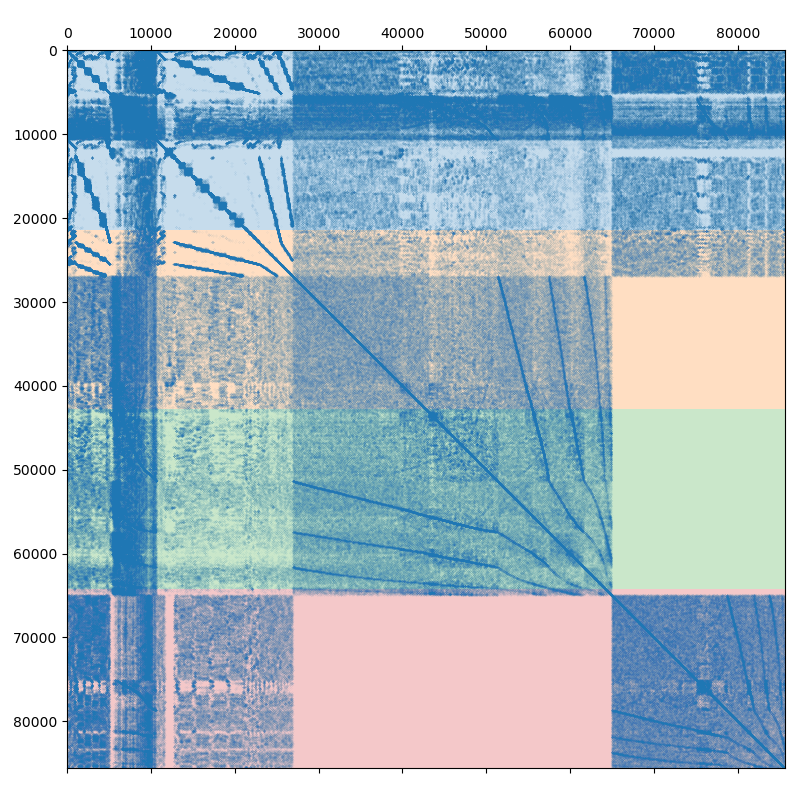

Poisson problem (MPI version)
-----------------------------

In section :doc:`poisson3Db` we looked at the solution of the 3D Poisson
problem (available for download at poisson3Db_ page) using the shared memory
approach. Lets solve the same problem using the Message Passing Interface
(MPI), or the distributed memory approach. We already know that using the
smoothed aggregation AMG with the simple SPAI(0) smoother is working well, so
we may start writing the code immediately.  The following is the complete
MPI-based implementation of the solver.  We discuss it in more details below.

.. literalinclude:: ../tutorial/1.poisson3Db/poisson3Db_mpi.cpp
   :caption: The MPI solution of the poisson3Db problem
   :language: cpp
   :linenos:

In lines 4--21 we include the required components. Here we are using the
builtin (OpenMP-based) backend and the CRS tuple adapter. Next we include
MPI-specific headers that provide the distributed-memory implementation of
AMGCL algorithms. This time, we are reading the system matrix and the RHS
vector in the binary format, and include ``<amgcl/io/binary.hpp>`` header
intead of the usual ``<amgcl/io/mm.hpp>``. The binary format is not only faster
to read, but it also allows to read the matrix and the RHS vector in chunks,
which is what we need for the distributed approach.

After checking the validity of the command line parameters, we initialize the
MPI context and communicator in lines 31--32:

.. literalinclude:: ../tutorial/1.poisson3Db/poisson3Db_mpi.cpp
   :language: cpp
   :linenos:
   :lines: 31-32
   :lineno-start: 31

The :cpp:class:`amgcl::mpi::init` is a convenience RAII wrapper for
:cpp:func:`MPI_Init()`. It will call :cpp:func:`MPI_Finalize` in the destructor
when its instance (``mpi``) goes out of scope at the end of the program. We
don't have to use the wrapper, but it simply makes things easier.
:cpp:class:`amgcl::mpi::communicator` is an equally thin wrapper for
``MPI_Comm``. :cpp:class:`amgcl::mpi::communicator` and ``MPI_Comm`` may be
used interchangeably both with the AMGCL MPI interface and the native MPI
functions.

The system has to be divided (partitioned) between multiple MPI processes. The
simplest way to do this is presented on the following figure:

.. _poisson3Db: https://sparse.tamu.edu/FEMLAB/poisson3Db

   Poisson3Db matrix partitioned between the 4 MPI processes

Assuming we are using 4 MPI processes, the matrix is split into 4 continuous
chunks of rows, so that each MPI process owns approximately 25% of the matrix.
This works well enough for a small number of processes, but as the size of the
compute cluster grows, the simple partitioning becomes less and less efficient.
Creating efficient partitioning is outside of AMGCL scope, but AMGCL does
provide wrappers for the ParMETIS_ and PT-SCOTCH_ libraries specializing in
this. The difference between the naive and the optimal partitioning is
demonstrated on the next figure:

.. _ParMETIS: http://glaros.dtc.umn.edu/gkhome/metis/parmetis/overview
.. _PT-SCOTCH: https://www.labri.fr/perso/pelegrin/scotch/

.. plot:: ../tutorial/1.poisson3Db/partition.py

   Naive vs optimal partitioning of a :math:`4\times4` grid between 4 MPI processes.

The figure shows the finite-diffrence discretization of a 2D Poisson problem on
a :math:`4\times4` grid in a unit square. The nonzero pattern of the system
matrix is presented on the lower left plot. If the grid nodes are numbered
row-wise, then the naive partitioning of the system matrix for the 4 MPI
processes is shown on the upper left plot. The subdomains belonging to each of
the MPI processes correspond to the continuous ranges of grid node indices and
are elongated along the X axis. This results in high MPI communication traffic,
as the number of the interface nodes is high relative to the number of interior
nodes.  The upper right plot shows the optimal partitioning of the domain for
the 4 MPI processes. In order to keep the rows owned by a single MPI process
adjacent to each other (so that each MPI process owns a continuous range of
rows, as required by AMGCL), the grid nodes have to be renumbered. The labels
in the top left corner of each grid node show the original numbering, and the
lower-rigth labels show the new numbering. The renumbering of the matrix may be
expressed as the permutation matrix :math:`P`, where :math:`P_{ij} = 1` if the
:math:`j`-th unknown in the original ordering is mapped to the :math:`i`-th
unknown in the new ordering. The reordered system may be written as

.. math:: P^T A P y = P^T f

The reordered matrix :math:`P^T A P` and the corresponding partitioning are
shown on lower right plot. Note that off-diagonal blocks on each MPI process
have as much as twice fewer non-zeros compared to the naive partitioning of the
matrix. The solution :math:`x` in the original ordering may be obtained with
:math:`x = P y`.

In lines 37--55 we read the system matrix and the RHS vector using the naive
ordering (better ordering of the unknowns will be determined later):

.. literalinclude:: ../tutorial/1.poisson3Db/poisson3Db_mpi.cpp
   :language: cpp
   :linenos:
   :lines: 37-55
   :lineno-start: 37

First, we read the total (global) number of rows in the matrix from the binary
file using the :cpp:func:`amgcl::io::crs_size()` function. Next, we divide the
global rows between the MPI processes, and read our portions of the matrix and
the RHS using :cpp:func:`amgcl::io::read_crs()` and
:cpp:func:`amgcl::io::read_dense()` functions. The ``row_beg`` and ``row_end``
parameters to the functions specify the regions (in row numbers) to read. The
column indices are kept in global numbering.

In lines 63--73 we define the backend and the solver types:

.. literalinclude:: ../tutorial/1.poisson3Db/poisson3Db_mpi.cpp
   :language: cpp
   :linenos:
   :lines: 63-73
   :lineno-start: 63

The structure of the solver is the same as in the shared memory case in the
:doc:`poisson3Db` tutorial, but we are using the components from the
``amgcl::mpi`` namespace. Again, we are using the mixed-precision approach and
the preconditioner backend is defined with a single-precision value type.

In lines 75--77 we create the distributed matrix from the local strips read by
each of the MPI processes:

.. literalinclude:: ../tutorial/1.poisson3Db/poisson3Db_mpi.cpp
   :language: cpp
   :linenos:
   :lines: 75-77
   :lineno-start: 75

We could directly use the tuple of the CRS arrays ``std::tie(chunk, ptr, col,
val)`` to construct the solver (the distributed matrix would be created behind
the scenes for us), but here we need to explicitly create the matrix for a
couple of reasons. First, since we are using the mixed-precision approach, we
need the double-precision distributed matrix for the solution step. And second,
the matrix will be used to repartition the system using either ParMETIS_ or
PT-SCOTCH_ libraries in lines 79--111:

.. literalinclude:: ../tutorial/1.poisson3Db/poisson3Db_mpi.cpp
   :language: cpp
   :linenos:
   :lines: 79-111
   :lineno-start: 79

We determine if either ParMETIS_ or PT-SCOTCH_ is available in lines 82--87,
and use the corresponding wrapper provided by the AMGCL. The wrapper computes
the permutation matrix :math:`P`, which is used to reorder both the system
matrix and the RHS vector. Since the reordering may change the number of rows
owned by each MPI process, we update the number of local rows stored in the
``chunk`` variable.

.. literalinclude:: ../tutorial/1.poisson3Db/poisson3Db_mpi.cpp
   :language: cpp
   :linenos:
   :lines: 113-129
   :lineno-start: 113

At this point we are ready to initialize the solver (line 115), and solve the
system (line 128). Here is the output of the compiled program. Note that the
environment variable ``OMP_NUM_THREADS`` is set to 1 in order to not
oversubscribe the available CPU cores::

    $ export OMP_NUM_THREADS=1
    $ mpirun -np 4 ./poisson3Db_mpi poisson3Db.bin poisson3Db_b.bin 
    World size: 4
    Matrix poisson3Db.bin: 85623x85623
    RHS poisson3Db_b.bin: 85623x1
    Partitioning[ParMETIS] 4 -> 4
    Type:             BiCGStab
    Unknowns:         21671
    Memory footprint: 1.16 M

    Number of levels:    3
    Operator complexity: 1.20
    Grid complexity:     1.08

    level     unknowns       nonzeros
    ---------------------------------
        0        85623        2374949 (83.06%) [4]
        1         6377         450473 (15.75%) [4]
        2          401          34039 ( 1.19%) [4]

    Iters: 24
    Error: 6.09835e-09

    [poisson3Db MPI:     1.273 s] (100.00%)
    [ self:              0.044 s] (  3.49%)
    [  partition:        0.626 s] ( 49.14%)
    [  read:             0.012 s] (  0.93%)
    [  setup:            0.152 s] ( 11.92%)
    [  solve:            0.439 s] ( 34.52%)

Similarly to how it was done in the :doc:`poisson3Db` section, we can use the
GPU backend in order to speed up the solution step. Since the CUDA backend does
not support the mixed-precision approach, we will use the VexCL_ backend, which
allows to employ CUDA, OpenCL, or OpenMP compute devices. The source code
(`tutorial/1.poisson3Db/poisson3Db_mpi_vexcl.cpp`_) is very similar to the
version using the builtin backend and is shown below with the differences
highligted.

.. _VexCL: https://github.com/ddemidov/vexcl
.. _tutorial/1.poisson3Db/poisson3Db_mpi_vexcl.cpp: https://github.com/ddemidov/amgcl/blob/master/tutorial/1.poisson3Db/poisson3Db_mpi_vexcl.cpp

.. literalinclude:: ../tutorial/1.poisson3Db/poisson3Db_mpi_vexcl.cpp
   :language: cpp
   :linenos:
   :emphasize-lines: 4,36-42,68,77-78,114,127-129,142-143

Basically, we replace the ``builtin`` backend with the ``vexcl`` one,
initialize the VexCL context and reference the context in the backend
parameters. The RHS and the solution vectors are need to be
transfered/allocated on the GPUs.
Below is the output of the VexCL version using the OpenCL technology. Note that
the system the tests were performed on has only two GPUs, so the test used just
two MPI processes. The environment variable ``OMP_NUM_THREADS`` was set to 2 in
order to fully utilize all available CPU cores::

    $ export OMP_NUM_THREADS=2
    $ mpirun -np 2 ./poisson3Db_mpi_vexcl_cl poisson3Db.bin poisson3Db_b.bin 
    0: GeForce GTX 960 (NVIDIA CUDA)
    1: GeForce GTX 1050 Ti (NVIDIA CUDA)
    World size: 2
    Matrix poisson3Db.bin: 85623x85623
    RHS poisson3Db_b.bin: 85623x1
    Partitioning[ParMETIS] 2 -> 2
    Type:             BiCGStab
    Unknowns:         43255
    Memory footprint: 2.31 M

    Number of levels:    3
    Operator complexity: 1.20
    Grid complexity:     1.08

    level     unknowns       nonzeros
    ---------------------------------
        0        85623        2374949 (83.03%) [2]
        1         6381         451279 (15.78%) [2]
        2          396          34054 ( 1.19%) [2]

    Iters: 24
    Error: 9.14603e-09

    [poisson3Db MPI(VexCL):     1.132 s] (100.00%)
    [ self:                     0.040 s] (  3.56%)
    [  partition:               0.607 s] ( 53.58%)
    [  read:                    0.015 s] (  1.31%)
    [  setup:                   0.287 s] ( 25.31%)
    [  solve:                   0.184 s] ( 16.24%)

