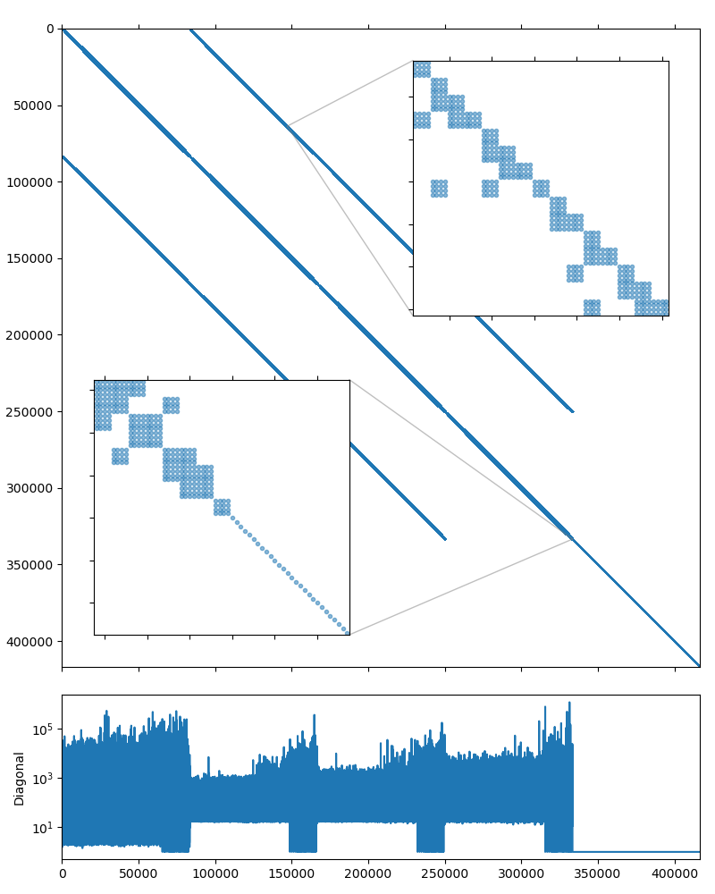

Fully coupled poroelastic problem
---------------------------------

This system may be downloaded from the CoupCons3D_ page (use the `Matrix
Market`_ download option). According to the description, the system has been
obtained through a Finite Element transient simulation of a fully coupled
consolidation problem on a three-dimensional domain using Finite Differences
for the discretization in time.  More details available in [FePG09]_ and
[FeJP12]_. The RHS vector for the CoupCons3D problem is not provided, and we
use the RHS vector filled with ones.

The system matrix is non-symmetric and has 416,800 rows and 17,277,420 nonzero
values, which corresponds to an average of 41 nonzeros per row. The matrix
portrait is shown on the figure below.

   CoupCons3D matrix portrait

.. _CoupCons3D: https://sparse.tamu.edu/Janna/CoupCons3D
.. _Matrix Market: https://math.nist.gov/MatrixMarket
.. _examples/mm2bin: https://github.com/ddemidov/amgcl/blob/master/examples/mm2bin.cpp
.. _examples/solver: https://github.com/ddemidov/amgcl/blob/master/examples/solver.cpp
.. _examples/schur_pressure_correction: https://github.com/ddemidov/amgcl/blob/master/examples/schur_pressure_correction.cpp

.. [FePG09] M. Ferronato, G. Pini, and G. Gambolati. The role of preconditioning in the solution to FE coupled consolidation equations by Krylov subspace methods. International Journal for Numerical and Analytical Methods in Geomechanics 33 (2009), pp. 405-423.
.. [FeJP12] M. Ferronato, C. Janna, and G. Pini. Parallel solution to ill-conditioned FE geomechanical problems. International Journal for Numerical and Analytical Methods in Geomechanics 36 (2012), pp. 422-437.

Once again, lets start our experiments with the `examples/solver`_ utility
after converting the matrix into binary format with `examples/mm2bin`_. The
default options do not seem to work for this problem::

    $ solver -B -A CoupCons3D.bin
    Solver
    ======
    Type:             BiCGStab
    Unknowns:         416800
    Memory footprint: 22.26 M

    Preconditioner
    ==============
    Number of levels:    4
    Operator complexity: 1.11
    Grid complexity:     1.09
    Memory footprint:    447.17 M

    level     unknowns       nonzeros      memory
    ---------------------------------------------
        0       416800       22322336    404.08 M (90.13%)
        1        32140        2214998     38.49 M ( 8.94%)
        2         3762         206242      3.58 M ( 0.83%)
        3          522          22424      1.03 M ( 0.09%)

    Iterations: 100
    Error:      0.705403

    [Profile:      16.981 s] (100.00%)
    [  reading:     0.187 s] (  1.10%)
    [  setup:       0.584 s] (  3.44%)
    [  solve:      16.209 s] ( 95.45%)

What seems to works is using the higher quality relaxation (incomplete LU
decomposition with zero fill-in)::

    $ solver -B -A CoupCons3D.bin precond.relax.type=ilu0
    Solver
    ======
    Type:             BiCGStab
    Unknowns:         416800
    Memory footprint: 22.26 M

    Preconditioner
    ==============
    Number of levels:    4
    Operator complexity: 1.11
    Grid complexity:     1.09
    Memory footprint:    832.12 M

    level     unknowns       nonzeros      memory
    ---------------------------------------------
        0       416800       22322336    751.33 M (90.13%)
        1        32140        2214998     72.91 M ( 8.94%)
        2         3762         206242      6.85 M ( 0.83%)
        3          522          22424      1.03 M ( 0.09%)

    Iterations: 47
    Error:      4.8263e-09

    [Profile:      13.664 s] (100.00%)
    [  reading:     0.188 s] (  1.38%)
    [  setup:       1.708 s] ( 12.50%)
    [  solve:      11.765 s] ( 86.11%)

From the matrix diagonal plot in :ref:`coupcons3d_spy` it is clear that
the system, as in :doc:`Serena` case, has high contrast coefficients.
Scaling the matrix so it has the unit diagonal should help here as well::

    $ solver -B -A CoupCons3D.bin precond.relax.type=ilu0 -s
    Solver
    ======
    Type:             BiCGStab
    Unknowns:         416800
    Memory footprint: 22.26 M

    Preconditioner
    ==============
    Number of levels:    3
    Operator complexity: 1.10
    Grid complexity:     1.08
    Memory footprint:    834.51 M

    level     unknowns       nonzeros      memory
    ---------------------------------------------
        0       416800       22322336    751.33 M (90.54%)
        1        32140        2214998     73.06 M ( 8.98%)
        2         2221         116339     10.12 M ( 0.47%)

    Iterations: 11
    Error:      9.79966e-09

    [Profile:       4.826 s] (100.00%)
    [ self:         0.064 s] (  1.34%)
    [  reading:     0.188 s] (  3.90%)
    [  setup:       1.885 s] ( 39.06%)
    [  solve:       2.689 s] ( 55.71%)

Another thing to note from the :ref:`coupcons3d_spy` is that the system matrix
has block structure, with two diagonal subblocks. The upper left subblock
contains 333,440 unknowns and seems to have a block structure of its own with
small :math:`4\times4` blocks, and the lower right subblock is a simple
diagonal matrix with 83,360 unknowns. Fortunately, 83,360 is divisible by 4, so
we should be able to treat the whole system as if it had :math:`4\times4` block
structure::

    $ solver -B -A CoupCons3D.bin precond.relax.type=ilu0 -s -b4
    Solver
    ======
    Type:             BiCGStab
    Unknowns:         104200
    Memory footprint: 22.26 M

    Preconditioner
    ==============
    Number of levels:    3
    Operator complexity: 1.18
    Grid complexity:     1.11
    Memory footprint:    525.68 M

    level     unknowns       nonzeros      memory
    ---------------------------------------------
        0       104200        1395146    445.04 M (84.98%)
        1        10365         235821     70.07 M (14.36%)
        2          600          10792     10.57 M ( 0.66%)

    Iterations: 4
    Error:      2.90461e-09

    [Profile:       1.356 s] (100.00%)
    [ self:         0.063 s] (  4.62%)
    [  reading:     0.188 s] ( 13.84%)
    [  setup:       0.478 s] ( 35.23%)
    [  solve:       0.628 s] ( 46.30%)

This is much better! Looks like switching to the block-valued backend not only
improved the setup and solution performance, but also increased the convergence
speed.  This version is about 12 times faster than the first working approach.
Lets see how this translates to the code, with the added bonus of using the
mixed precision solution. The source below shows the complete solution and is
also available in `tutorial/3.CoupCons3D/coupcons3d.cpp`_. The only differences
(highlighted in the listing) with the solution from :doc:`Serena` are the
choices of the iterative solver and the smoother, and the block size.

.. literalinclude:: ../../tutorial/3.CoupCons3D/coupcons3d.cpp
   :caption: The source code for the solution of the CoupCons3D problem.
   :language: cpp
   :linenos:
   :emphasize-lines: 9-10,66-68,77,79,101-102

.. _tutorial/3.CoupCons3D/coupcons3d.cpp: https://github.com/ddemidov/amgcl/blob/master/tutorial/3.CoupCons3D/coupcons3d.cpp

The output from the compiled program is given below. The main improvement here
is the reduced memory footprint of the single-precision preconditioner: it
takes 279.83M as opposed to 525.68M in the full precision case. The setup and
the solution are slightly faster as well::

    $ ./coupcons3d CoupCons3D.mtx 
    Matrix CoupCons3D.mtx: 416800x416800
    Solver
    ======
    Type:             BiCGStab
    Unknowns:         104200
    Memory footprint: 22.26 M

    Preconditioner
    ==============
    Number of levels:    3
    Operator complexity: 1.18
    Grid complexity:     1.11
    Memory footprint:    279.83 M

    level     unknowns       nonzeros      memory
    ---------------------------------------------
        0       104200        1395146    237.27 M (84.98%)
        1        10365         235821     37.27 M (14.36%)
        2          600          10792      5.29 M ( 0.66%)

    Iters: 4
    Error: 2.90462e-09

    [Serena:     14.415 s] (100.00%)
    [ self:       0.057 s] (  0.39%)
    [  read:     13.426 s] ( 93.14%)
    [  setup:     0.345 s] (  2.39%)
    [  solve:     0.588 s] (  4.08%)

We can also use the VexCL backend to accelerate the solution using the GPU.
Again, this is very close to the approach described in :doc:`Serena` (see
`tutorial/3.CoupCons3D/coupcons3d_vexcl.cpp`_). However, the ILU(0) relaxation is
an intrinsically serial algorithm, and is not effective with the fine grained
parallelism of the GPU. Instead, the solutions of the lower and upper parts of
the incomplete LU decomposition in AMGCL are approximated with several Jacobi
iterations [ChPa15]_. This makes the relaxation relatively more expensive than
on the CPU, and the speedup from using the GPU backend is not as prominent::

    $ ./coupcons3d_vexcl_cuda CoupCons3D.mtx 
    1. GeForce GTX 1050 Ti

    Matrix CoupCons3D.mtx: 416800x416800
    Solver
    ======
    Type:             BiCGStab
    Unknowns:         104200
    Memory footprint: 22.26 M

    Preconditioner
    ==============
    Number of levels:    3
    Operator complexity: 1.18
    Grid complexity:     1.11
    Memory footprint:    281.49 M

    level     unknowns       nonzeros      memory
    ---------------------------------------------
        0       104200        1395146    238.79 M (84.98%)
        1        10365         235821     37.40 M (14.36%)
        2          600          10792      5.31 M ( 0.66%)

    Iters: 5
    Error: 6.30647e-09

    [Serena:          14.432 s] (100.00%)
    [ self:            0.060 s] (  0.41%)
    [  GPU matrix:     0.213 s] (  1.47%)
    [  read:          13.381 s] ( 92.72%)
    [  setup:          0.549 s] (  3.81%)
    [  solve:          0.229 s] (  1.59%)

.. _tutorial/3.CoupCons3D/coupcons3d_vexcl.cpp: https://github.com/ddemidov/amgcl/blob/master/tutorial/3.CoupCons3D/coupcons3d_vexcl.cpp

.. note::

    We used the fact that the matrix size is divisible by 4 in order to use the
    block-valued backend. If it was not the case, we could use the Schur pressure correction
    preconditioner to split the matrix into two large subsystems, and use
    the block-valued solver for the upper left subsystem. See an example of such a
    solution in `tutorial/3.CoupCons3D/coupcons3d_spc.cpp`_. The performance is
    worse than what we were able to achive above, but still is better than the
    first working version::

        $ ./coupcons3d_spc CoupCons3D.mtx 333440
        Matrix CoupCons3D.mtx: 416800x416800
        Solver
        ======
        Type:             BiCGStab
        Unknowns:         416800
        Memory footprint: 22.26 M

        Preconditioner
        ==============
        Schur complement (two-stage preconditioner)
          Unknowns: 416800(83360)
          Nonzeros: 22322336
          Memory:  549.90 M

        [ U ]
        Solver
        ======
        Type:             PreOnly
        Unknowns:         83360
        Memory footprint: 0.00 B

        Preconditioner
        ==============
        Number of levels:    4
        Operator complexity: 1.21
        Grid complexity:     1.23
        Memory footprint:    206.09 M

        level     unknowns       nonzeros      memory
        ---------------------------------------------
            0        83360        1082798    167.26 M (82.53%)
            1        14473         184035     28.49 M (14.03%)
            2         4105          39433      6.04 M ( 3.01%)
            3          605           5761      4.30 M ( 0.44%)

        [ P ]
        Solver
        ======
        Type:             PreOnly
        Unknowns:         83360
        Memory footprint: 0.00 B

        Preconditioner
        ==============
        Relaxation as preconditioner
          Unknowns: 83360
          Nonzeros: 2332064
          Memory:   27.64 M

        Iters: 7
        Error: 5.0602e-09

        [CoupCons3D:    14.427 s] (100.00%)
        [  read:        13.010 s] ( 90.18%)
        [  setup:        0.336 s] (  2.33%)
        [  solve:        1.079 s] (  7.48%)

.. _tutorial/3.CoupCons3D/coupcons3d_spc.cpp: https://github.com/ddemidov/amgcl/blob/master/tutorial/3.CoupCons3D/coupcons3d_spc.cpp
