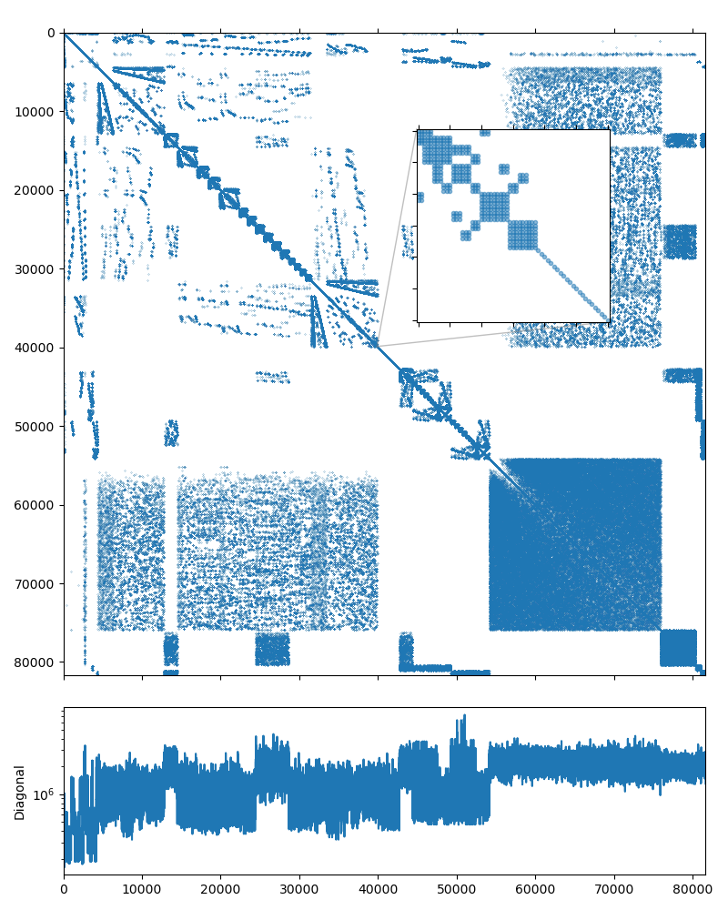

Using near null-space vectors
-----------------------------

Using near null-space vectors may greately improve the quality of the
aggregation AMG preconditioner. For the elasticity or structural problems the
near-null space vectors may be computed as rigid body modes from the
coordinates of the discretization grid nodes. In this tutorial we will use the
system obtained by discretization of a 3D elasticity problem modeling a
connecting rod:

.. figure:: ../../tutorial/5.Nullspace/displacements.png
   :width: 90%
   :name: connrod_msh

   The connecting rod geometry with the computed displacements

The dataset was kindly provided by David Herrero Pérez (`@davidherreroperez
<https://github.com/davidherreroperez>`_) in the issue `#135
<https://github.com/ddemidov/amgcl/issues/135>`_ on Github and is
available for download at `doi:10.5281/zenodo.4299865
<https://doi.org/10.5281/zenodo.4299865>`_. The system matrix is symmetric, has
block structure with small :math:`3\times3` blocks, and
has 81,657 rows and 3,171,111 nonzero values (about 39 nonzero entries per row
on average). The matrix portrait is shown on the figure below:

   The nonzero portrait of the connecting rod system.

It is possible to solve the system using the CG iterative solver preconditioned
with the smoothed aggregation AMG, but the convergence is not that great::

    $ solver -A A.mtx -f b.mtx solver.type=cg solver.maxiter=1000
    Solver
    ======
    Type:             CG
    Unknowns:         81657
    Memory footprint: 2.49 M

    Preconditioner
    ==============
    Number of levels:    3
    Operator complexity: 1.14
    Grid complexity:     1.07
    Memory footprint:    70.09 M

    level     unknowns       nonzeros      memory
    ---------------------------------------------
        0        81657        3171111     62.49 M (87.98%)
        1         5067         417837      7.16 M (11.59%)
        2          305          15291    450.07 K ( 0.42%)

    Iterations: 698
    Error:      8.96391e-09

    [Profile:      11.717 s] (100.00%)
    [  reading:     2.123 s] ( 18.12%)
    [  setup:       0.122 s] (  1.04%)
    [  solve:       9.472 s] ( 80.84%)

We can improve the solution time by taking the block structure of the system into
account in the aggregation algorithm::

    $ solver -A A.mtx -f b.mtx solver.type=cg solver.maxiter=1000 \
          precond.coarsening.aggr.block_size=3
    Solver
    ======
    Type:             CG
    Unknowns:         81657
    Memory footprint: 2.49 M

    Preconditioner
    ==============
    Number of levels:    3
    Operator complexity: 1.29
    Grid complexity:     1.10
    Memory footprint:    92.40 M

    level     unknowns       nonzeros      memory
    ---------------------------------------------
        0        81657        3171111     75.83 M (77.71%)
        1         7773         858051     15.70 M (21.03%)
        2          555          51327    890.16 K ( 1.26%)

    Iterations: 197
    Error:      8.76043e-09

    [Profile:       5.525 s] (100.00%)
    [  reading:     2.170 s] ( 39.28%)
    [  setup:       0.173 s] (  3.14%)
    [  solve:       3.180 s] ( 57.56%)

.. _examples/solver: https://github.com/ddemidov/amgcl/blob/master/examples/solver.cpp

However, since this is an elasticity problem and we know the coordinates for
the discretization mesh, we can compute the rigid body modes and provide them
as the near null-space vectors for the smoothed aggregation AMG method. AMGCL
has a convenience function :cpp:func:`amgcl::coarsening::rigid_body_modes()`
that takes the 2D or 3D coordinates and converts them into the rigid body
modes. The `examples/solver`_ utility allows to specify the file containing the
coordinates on the command line::

    $ solver -A A.mtx -f b.mtx solver.type=cg \
          precond.coarsening.aggr.eps_strong=0 -C C.mtx
    Solver
    ======
    Type:             CG
    Unknowns:         81657
    Memory footprint: 2.49 M

    Preconditioner
    ==============
    Number of levels:    3
    Operator complexity: 1.52
    Grid complexity:     1.10
    Memory footprint:    132.15 M

    level     unknowns       nonzeros      memory
    ---------------------------------------------
        0        81657        3171111    102.70 M (65.77%)
        1         7704        1640736     29.33 M (34.03%)
        2          144           9576    122.07 K ( 0.20%)

    Iterations: 63
    Error:      8.4604e-09

    [Profile:       3.764 s] (100.00%)
    [  reading:     2.217 s] ( 58.89%)
    [  setup:       0.350 s] (  9.30%)
    [  solve:       1.196 s] ( 31.78%)

In the 3D case we get 6 near null-space vectors corresponding to the rigid body
modes. Note that this makes the proeconditioner more expensive memory-wise: the
memory footprint of the preconditioner has increased to 132M from 70M in the
simplest case and 92M in the case using the block structure of the matrix. But
this pays up in terms of performance: the number of iterations dropped from 197
to 63 and the solution time decreased from 3.2 seconds to 1.2 seconds.

.. _examples/ns_search.cpp: https://github.com/ddemidov/amgcl/blob/master/examples/ns_search.cpp

In principle, it is also possible to approximate the near null-space vectors by
solving the homogeneous system :math:`Ax=0`, starting with a random initial
solution :math:`x`. We may use the computed :math:`x` as a near-null space
vector, solve the homogeneous system again from a different random start, and
do this until we have enough near null-space vectors. The
`examples/ns_search.cpp`_ example shows how to do this. However, this process
is quite expensive, because we need to solve the system multiple times,
starting with a badly tuned solver at that. It is probably only worth the time
in case one needs to solve the same system efficiently for multiple right-hand
side vectors. Below is an example of searching for the 6 near null-space
vectors::

    $ ns_search -A A.mtx -f b.mtx solver.type=cg solver.maxiter=1000 \
          precond.coarsening.aggr.eps_strong=0 -n6 -o N6.mtx

    -------------------------
    -- Searching for vector 0
    -------------------------
    Solver
    ======
    Type:             CG
    Unknowns:         81657
    Memory footprint: 2.49 M

    Preconditioner
    ==============
    Number of levels:    2
    Operator complexity: 1.01
    Grid complexity:     1.02
    Memory footprint:    62.79 M

    level     unknowns       nonzeros      memory
    ---------------------------------------------
        0        81657        3171111     60.56 M (98.58%)
        1         1284          45576      2.24 M ( 1.42%)

    Iterations: 932
    Error:      8.66233e-09

    -------------------------
    -- Searching for vector 1
    -------------------------
    Solver
    ======
    Type:             CG
    Unknowns:         81657
    Memory footprint: 2.49 M

    Preconditioner
    ==============
    Number of levels:    2
    Operator complexity: 1.01
    Grid complexity:     1.02
    Memory footprint:    62.79 M

    level     unknowns       nonzeros      memory
    ---------------------------------------------
        0        81657        3171111     60.56 M (98.58%)
        1         1284          45576      2.24 M ( 1.42%)

    Iterations: 750
    Error:      9.83476e-09

    -------------------------
    -- Searching for vector 2
    -------------------------
    Solver
    ======
    Type:             CG
    Unknowns:         81657
    Memory footprint: 2.49 M

    Preconditioner
    ==============
    Number of levels:    2
    Operator complexity: 1.06
    Grid complexity:     1.03
    Memory footprint:    76.72 M

    level     unknowns       nonzeros      memory
    ---------------------------------------------
        0        81657        3171111     68.98 M (94.56%)
        1         2568         182304      7.74 M ( 5.44%)

    Iterations: 528
    Error:      8.74633e-09

    -------------------------
    -- Searching for vector 3
    -------------------------
    Solver
    ======
    Type:             CG
    Unknowns:         81657
    Memory footprint: 2.49 M

    Preconditioner
    ==============
    Number of levels:    3
    Operator complexity: 1.13
    Grid complexity:     1.05
    Memory footprint:    84.87 M

    level     unknowns       nonzeros      memory
    ---------------------------------------------
        0        81657        3171111     77.41 M (88.49%)
        1         3852         410184      7.42 M (11.45%)
        2           72           2394     31.36 K ( 0.07%)

    Iterations: 391
    Error:      9.04425e-09

    -------------------------
    -- Searching for vector 4
    -------------------------
    Solver
    ======
    Type:             CG
    Unknowns:         81657
    Memory footprint: 2.49 M

    Preconditioner
    ==============
    Number of levels:    3
    Operator complexity: 1.23
    Grid complexity:     1.06
    Memory footprint:    99.01 M

    level     unknowns       nonzeros      memory
    ---------------------------------------------
        0        81657        3171111     85.84 M (81.22%)
        1         5136         729216     13.11 M (18.68%)
        2           96           4256     55.00 K ( 0.11%)

    Iterations: 238
    Error:      9.51092e-09

    -------------------------
    -- Searching for vector 5
    -------------------------
    Solver
    ======
    Type:             CG
    Unknowns:         81657
    Memory footprint: 2.49 M

    Preconditioner
    ==============
    Number of levels:    3
    Operator complexity: 1.36
    Grid complexity:     1.08
    Memory footprint:    114.78 M

    level     unknowns       nonzeros      memory
    ---------------------------------------------
        0        81657        3171111     94.27 M (73.45%)
        1         6420        1139400     20.42 M (26.39%)
        2          120           6650     85.24 K ( 0.15%)

    Iterations: 175
    Error:      9.43207e-09

    -------------------------
    -- Solving the system 
    -------------------------
    Solver
    ======
    Type:             CG
    Unknowns:         81657
    Memory footprint: 2.49 M

    Preconditioner
    ==============
    Number of levels:    3
    Operator complexity: 1.52
    Grid complexity:     1.10
    Memory footprint:    132.15 M

    level     unknowns       nonzeros      memory
    ---------------------------------------------
        0        81657        3171111    102.70 M (65.77%)
        1         7704        1640736     29.33 M (34.03%)
        2          144           9576    122.07 K ( 0.20%)

    Iterations: 100
    Error:      8.14427e-09

    [Profile:         48.503 s] (100.00%)
    [  apply:          2.373 s] (  4.89%)
    [    setup:        0.422 s] (  0.87%)
    [    solve:        1.949 s] (  4.02%)
    [  read:           2.113 s] (  4.36%)
    [  search:        43.713 s] ( 90.12%)
    [    vector 0:    12.437 s] ( 25.64%)
    [      setup:      0.101 s] (  0.21%)
    [      solve:     12.335 s] ( 25.43%)
    [    vector 1:     9.661 s] ( 19.92%)
    [      setup:      0.115 s] (  0.24%)
    [      solve:      9.545 s] ( 19.68%)
    [    vector 2:     7.584 s] ( 15.64%)
    [      setup:      0.217 s] (  0.45%)
    [      solve:      7.365 s] ( 15.18%)
    [    vector 3:     6.137 s] ( 12.65%)
    [      setup:      0.180 s] (  0.37%)
    [      solve:      5.954 s] ( 12.28%)
    [    vector 4:     4.353 s] (  8.97%)
    [      setup:      0.246 s] (  0.51%)
    [      solve:      4.100 s] (  8.45%)
    [    vector 5:     3.541 s] (  7.30%)
    [      setup:      0.337 s] (  0.69%)
    [      solve:      3.200 s] (  6.60%)
    [  write:          0.303 s] (  0.63%)

Note that the number of iterations required to find the next vector is
gradually decreasing, as the quality of the solver increases. The 6
orthogonalized vectors are saved to the output file ``N6.mtx`` and are also
used to solve the original system. We can also use the file with the
`examples/solver`_::

    $ solver -A A.mtx -f b.mtx solver.type=cg \
          precond.coarsening.aggr.eps_strong=0 -N N6.mtx
    Solver
    ======
    Type:             CG
    Unknowns:         81657
    Memory footprint: 2.49 M

    Preconditioner
    ==============
    Number of levels:    3
    Operator complexity: 1.52
    Grid complexity:     1.10
    Memory footprint:    132.15 M

    level     unknowns       nonzeros      memory
    ---------------------------------------------
        0        81657        3171111    102.70 M (65.77%)
        1         7704        1640736     29.33 M (34.03%)
        2          144           9576    122.07 K ( 0.20%)

    Iterations: 100
    Error:      8.14427e-09

    [Profile:       4.736 s] (100.00%)
    [  reading:     2.407 s] ( 50.83%)
    [  setup:       0.354 s] (  7.47%)
    [  solve:       1.974 s] ( 41.69%)

This is an improvement with respect to the version that only uses the blockwize
structure of the matrix, but is about 50% less effective than the version using
the grid coordinates in order to compute the rigid body modes.

The listing below shows the complete source code computing the near null-space
vectors from the mesh coordinates and using the vectors in order to improve the
quality of the preconditioner. We include the
``<amgcl/coarsening/rigid_body_modes.hpp>`` header to bring the definition of
the :cpp:func:`amgcl::coarsening::rigid_body_modes()` function in line 9, and
use the function to convert the 3D coordinates into the 6 near null-space
vectors (rigid body modes) in lines 65--66. In lines 37--38 we check that the
coordinate file has the correct dimensions (since each grid node has three
displacement components associated with the node, the coordinate file should
have three times less rows than the system matrix). The rest of the code should
be quite familiar.

.. literalinclude:: ../../tutorial/5.Nullspace/nullspace.cpp
   :caption: The solution of the connecting rod problem using the near null-space vectors.
   :language: cpp
   :linenos:
   :emphasize-lines: 9,37-38,65-66

.. _tutorial/5.Nullspace/nullspace.cpp: https://github.com/ddemidov/amgcl/blob/master/tutorial/5.Nullspace/nullspace.cpp

The output of the compiled program is shown below::

    $ ./nullspace A.mtx b.mtx C.mtx 
    Matrix A.mtx: 81657x81657
    RHS b.mtx: 81657x1
    Coords C.mtx: 27219x3
    Solver
    ======
    Type:             CG
    Unknowns:         81657
    Memory footprint: 2.49 M

    Preconditioner
    ==============
    Number of levels:    3
    Operator complexity: 1.52
    Grid complexity:     1.10
    Memory footprint:    98.76 M

    level     unknowns       nonzeros      memory
    ---------------------------------------------
        0        81657        3171111     76.73 M (65.77%)
        1         7704        1640736     21.97 M (34.03%)
        2          144           9576     61.60 K ( 0.20%)

    Iters: 63
    Error: 8.46024e-09

    [Nullspace:     3.653 s] (100.00%)
    [  read:        2.173 s] ( 59.48%)
    [  setup:       0.326 s] (  8.94%)
    [  solve:       1.150 s] ( 31.48%)

