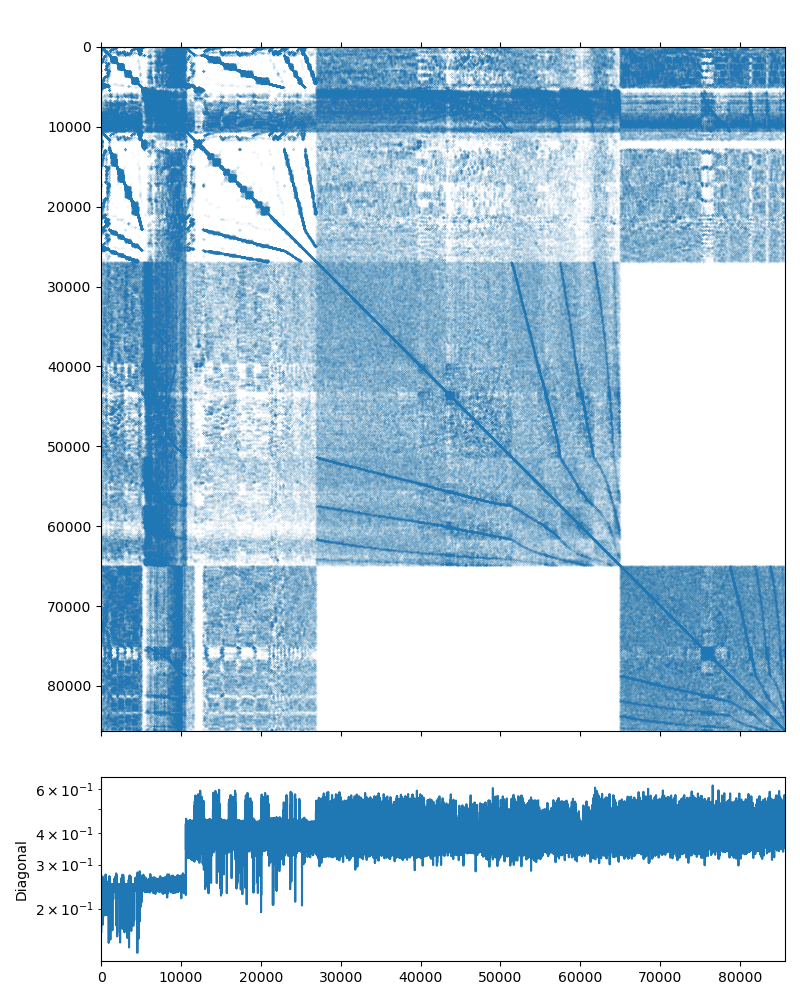

Poisson problem
---------------

This system may be downloaded from the poisson3Db_ page (use the `Matrix
Market`_ download option). The system matrix has 85,623 rows and 2,374,949
nonzeros (which is on average is about 27 non-zero elements per row). The
matrix has an interesting structure, presented on the figure below:

.. _poisson3Db: https://sparse.tamu.edu/FEMLAB/poisson3Db
.. _Matrix Market: https://math.nist.gov/MatrixMarket

   Poisson3Db matrix portrait

A Poisson problem should be an ideal candidate for a solution with an AMG
preconditioner, but before we start writing any code, let us check this with
the `examples/solver`_ utility provided by AMGCL. It can take the input matrix
and the RHS in the `Matrix Market`_ format, and allows to play with various
solver and preconditioner options.

.. _examples/solver: https://github.com/ddemidov/amgcl/blob/master/examples/solver.cpp

.. note::

    The `examples/solver`_ is convenient not only for testing the systems
    obtained elsewhere. You can also save your own matrix and the RHS vector
    into the `Matrix Market`_ format with :cpp:func:`amgcl::io::mm_write()`
    function. This way you can find the AMGCL options that work for your
    problem without the need to rewrite the code and recompile the program.

The default options of BiCGStab iterative solver preconditioned with a smoothed
aggregation AMG (a simple diagonal SPAI(0) relaxation is used on each level of
the AMG hierarchy) should work very well for a Poisson problem::

    $ solver -A poisson3Db.mtx -f poisson3Db_b.mtx
    Solver
    ======
    Type:             BiCGStab
    Unknowns:         85623
    Memory footprint: 4.57 M

    Preconditioner
    ==============
    Number of levels:    3
    Operator complexity: 1.20
    Grid complexity:     1.08
    Memory footprint:    58.93 M

    level     unknowns       nonzeros      memory
    ---------------------------------------------
        0        85623        2374949     50.07 M (83.20%)
        1         6361         446833      7.78 M (15.65%)
        2          384          32566      1.08 M ( 1.14%)

    Iterations: 24
    Error:      8.33789e-09

    [Profile:       2.351 s] (100.00%)
    [  reading:     1.623 s] ( 69.01%)
    [  setup:       0.136 s] (  5.78%)
    [  solve:       0.592 s] ( 25.17%)

As we can see from the output, the solution converged in 24 iterations to the
default relative error of 1e-8. The solver setup took 0.136 seconds and the
solution time is 0.592 seconds. The iterative solver used 4.57M of memory, and
the preconditioner required 58.93M. This looks like a well-performing solver
already, but we can try a couple of things just in case. We can not use the
simpler CG solver, because the matrix is reported as a non-symmetric on the
poisson3Db_ page. Using the GMRES solver seems to work equally well (the
solution time is just slightly lower, but the solver requires more memory to
store the orthogonal vectors). The number of iterations seems to have grown,
but keep in mind that each iteration of BiCGStab requires two matrix-vector
products and two preconditioner applications, while GMRES only makes one of
each::

    $ solver -A poisson3Db.mtx -f poisson3Db_b.mtx solver.type=gmres
    Solver
    ======
    Type:             GMRES(30)
    Unknowns:         85623
    Memory footprint: 20.91 M

    Preconditioner
    ==============
    Number of levels:    3
    Operator complexity: 1.20
    Grid complexity:     1.08
    Memory footprint:    58.93 M

    level     unknowns       nonzeros      memory
    ---------------------------------------------
        0        85623        2374949     50.07 M (83.20%)
        1         6361         446833      7.78 M (15.65%)
        2          384          32566      1.08 M ( 1.14%)

    Iterations: 39
    Error:      9.50121e-09

    [Profile:       2.282 s] (100.00%)
    [  reading:     1.612 s] ( 70.66%)
    [  setup:       0.135 s] (  5.93%)
    [  solve:       0.533 s] ( 23.38%)

We can also try differrent relaxation options for the AMG preconditioner. But
as we can see below, the simplest SPAI(0) works well enough for a Poisson
problem.  The incomplete LU decomposition with zero fill-in makes less
iterations, but is more expensive to setup::

    $ solver -A poisson3Db.mtx -f poisson3Db_b.mtx precond.relax.type=ilu0
    Solver
    ======
    Type:             BiCGStab
    Unknowns:         85623
    Memory footprint: 4.57 M

    Preconditioner
    ==============
    Number of levels:    3
    Operator complexity: 1.20
    Grid complexity:     1.08
    Memory footprint:    103.44 M

    level     unknowns       nonzeros      memory
    ---------------------------------------------
        0        85623        2374949     87.63 M (83.20%)
        1         6361         446833     14.73 M (15.65%)
        2          384          32566      1.08 M ( 1.14%)

    Iterations: 12
    Error:      7.99207e-09

    [Profile:       2.510 s] (100.00%)
    [ self:         0.005 s] (  0.19%)
    [  reading:     1.614 s] ( 64.30%)
    [  setup:       0.464 s] ( 18.51%)
    [  solve:       0.427 s] ( 17.01%)

On the other hand, the Chebyshev relaxation has cheap setup but its
application is expensive as it involves multiple matrix-vector products. So,
even it requires less iterations, the overall solution time does not improve
that much::

    $ solver -A poisson3Db.mtx -f poisson3Db_b.mtx precond.relax.type=chebyshev
    Solver
    ======
    Type:             BiCGStab
    Unknowns:         85623
    Memory footprint: 4.57 M

    Preconditioner
    ==============
    Number of levels:    3
    Operator complexity: 1.20
    Grid complexity:     1.08
    Memory footprint:    59.63 M

    level     unknowns       nonzeros      memory
    ---------------------------------------------
        0        85623        2374949     50.72 M (83.20%)
        1         6361         446833      7.83 M (15.65%)
        2          384          32566      1.08 M ( 1.14%)

    Iterations: 8
    Error:      5.21588e-09

    [Profile:       2.316 s] (100.00%)
    [  reading:     1.607 s] ( 69.39%)
    [  setup:       0.134 s] (  5.78%)
    [  solve:       0.574 s] ( 24.80%)

Now that we have the feel of the problem, we can actually write some code. The
complete source may be found in `tutorial/1.poisson3Db/poisson3Db.cpp`_ and is
presented below:

.. literalinclude:: ../../tutorial/1.poisson3Db/poisson3Db.cpp
   :caption: The source code for the solution of the poisson3Db problem.
   :language: cpp
   :linenos:

.. _tutorial/1.poisson3Db/poisson3Db.cpp: https://github.com/ddemidov/amgcl/blob/master/tutorial/1.poisson3Db/poisson3Db.cpp

In lines 4--10 we include the necessary AMGCL headers:
the builtin backend uses the OpenMP threading model; the ``crs_tuple`` matrix
adaper allows to use a ``std::tuple`` of CRS arrays as an input matrix; the
:cpp:class:`amgcl::make_solver` class binds together a preconditioner and an iterative
solver; :cpp:class:`amgcl::amg` class is the AMG preconditioner;
:cpp:class:`amgcl::coarsening::smoothed_aggregation` defines the smoothed
aggreation coarsening strategy; :cpp:class:`amgcl::relaxation::spai0` is the
sparse approximate inverse relaxation used on each level of the AMG hierarchy;
and :cpp:class:`amgcl::solver::bicgstab` is the BiCGStab iterative solver.
In lines 12--13 we include the `Matrix Market`_ reader and the AMGCL profiler.

After checking the validity of the command line arguments (lines 16--20), and
initializing the profiler (line 23), we read the system matrix and the RHS
vector from the `Matrix Market`_ files specified on the command line (lines
30--36).

Now we are ready to actually solve the system. First, we define the backends
that we use with the iterative solver and the preconditioner (lines 44--51).
The backend have to belong to the same class (in this case,
:cpp:class:`amgcl::backend::builtin`), but may have different value type
precision. Here we use a double precision backend for the iterative solver, but
choose either a double or a single precision for the preconditioner backend,
depending on whether the preprocessor macro ``MIXED_PRECISION`` was defined
during compilation. Using a single precision preconditioner may be both more
memory efficient and faster, since the iterative solvers performance is usually
memory-bound.

The defined backends are used in the solver definition (lines 53--60). Here we
are using the :cpp:class:`amgcl::make_solver` class to couple the AMG
preconditioner with the BiCGStab iterative solver. We istantiate the solver in
line 64.

.. note:

    The same solver may be used multiple times with different RHS vectors.

In line 76 we solve the system for the given RHS vector, starting with a zero
initial approximation (the ``x`` vector acts as an initial approximation on
input, and contains the solution on output).

Below is the output of the program when compiled with a double precision
preconditioner. The results are close to what we have seen with the
`examples/solver`_ utility above, which is a good sign::

    $ ./poisson3Db poisson3Db.mtx poisson3Db_b.mtx
    Matrix poisson3Db.mtx: 85623x85623
    RHS poisson3Db_b.mtx: 85623x1
    Solver
    ======
    Type:             BiCGStab
    Unknowns:         85623
    Memory footprint: 4.57 M

    Preconditioner
    ==============
    Number of levels:    3
    Operator complexity: 1.20
    Grid complexity:     1.08
    Memory footprint:    58.93 M

    level     unknowns       nonzeros      memory
    ---------------------------------------------
        0        85623        2374949     50.07 M (83.20%)
        1         6361         446833      7.78 M (15.65%)
        2          384          32566      1.08 M ( 1.14%)

    Iters: 24
    Error: 8.33789e-09

    [poisson3Db:     2.412 s] (100.00%)
    [  read:         1.618 s] ( 67.08%)
    [  setup:        0.143 s] (  5.94%)
    [  solve:        0.651 s] ( 26.98%)

Looking at the output of the mixed precision version, it is apparent that it
uses less memory for the preconditioner (43.59M as opposed to 58.93M in the
double-precision case), and is slightly faster during both the setup and the
solution phases::

    $ ./poisson3Db_mixed poisson3Db.mtx poisson3Db_b.mtx
    Matrix poisson3Db.mtx: 85623x85623
    RHS poisson3Db_b.mtx: 85623x1
    Solver
    ======
    Type:             BiCGStab
    Unknowns:         85623
    Memory footprint: 4.57 M

    Preconditioner
    ==============
    Number of levels:    3
    Operator complexity: 1.20
    Grid complexity:     1.08
    Memory footprint:    43.59 M

    level     unknowns       nonzeros      memory
    ---------------------------------------------
        0        85623        2374949     37.23 M (83.20%)
        1         6361         446833      5.81 M (15.65%)
        2          384          32566    554.90 K ( 1.14%)

    Iters: 24
    Error: 7.33493e-09

    [poisson3Db:     2.234 s] (100.00%)
    [  read:         1.559 s] ( 69.78%)
    [  setup:        0.125 s] (  5.59%)
    [  solve:        0.550 s] ( 24.62%)

We may also try to switch to the CUDA backend in order to accelerate the
solution using an NVIDIA GPU. We only need to use the
:cpp:class:`amgcl::backend::cuda` instead of the ``builtin`` backend, and we
also need to initialize the CUSPARSE library and pass the handle to AMGCL as
the backend parameters. Unfortunately, we can not use the mixed precision
approach, as CUSPARSE does not support that (we could use the VexCL_ backend
though, see :doc:`poisson3DbMPI`). The source code is very close to what we
have seen above and is available at
`tutorial/1.poisson3Db/poisson3Db_cuda.cu`_. The listing below has the
differences highligted:

.. literalinclude:: ../../tutorial/1.poisson3Db/poisson3Db_cuda.cu
   :caption: The source code for the solution of the poisson3Db problem using the CUDA backend.
   :language: cuda
   :linenos:
   :emphasize-lines: 4,22-27,51,63-64,69,73,83-84

.. _VexCL: https://github.com/ddemidov/vexcl
.. _tutorial/1.poisson3Db/poisson3Db_cuda.cu: https://github.com/ddemidov/amgcl/blob/master/tutorial/1.poisson3Db/poisson3Db_cuda.cu

Using the consumer level GeForce GTX 1050 Ti GPU, the solution phase is almost
4 times faster than with the OpenMP backend. On the contrary, the setup is
slower, because we now need to additionally initialize the GPU-side structures.
Overall, the complete solution is about twice faster (comparing with the double
precision OpenMP version)::

    $ ./poisson3Db_cuda poisson3Db.mtx poisson3Db_b.mtx
    GeForce GTX 1050 Ti
    Matrix poisson3Db.mtx: 85623x85623
    RHS poisson3Db_b.mtx: 85623x1
    Solver
    ======
    Type:             BiCGStab
    Unknowns:         85623
    Memory footprint: 4.57 M

    Preconditioner
    ==============
    Number of levels:    3
    Operator complexity: 1.20
    Grid complexity:     1.08
    Memory footprint:    44.81 M

    level     unknowns       nonzeros      memory
    ---------------------------------------------
        0        85623        2374949     37.86 M (83.20%)
        1         6361         446833      5.86 M (15.65%)
        2          384          32566      1.09 M ( 1.14%)

    Iters: 24
    Error: 8.33789e-09

    [poisson3Db:     2.253 s] (100.00%)
    [ self:          0.223 s] (  9.90%)
    [  read:         1.676 s] ( 74.39%)
    [  setup:        0.183 s] (  8.12%)
    [  solve:        0.171 s] (  7.59%)

